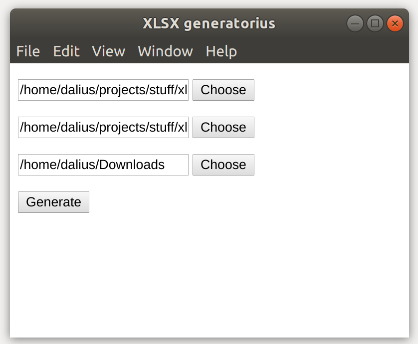

# xlsx-generator

This is simple application that can be used to generate multiple excel files from template
and data excel files.

# Installation

Install yarn if you don't have it yet:

```sh
npm install -g yarn
```

Install dependencies:

```sh
yarn install
```

# Usage

To start application type `npm start`. You should see window
similar to this one:



You can use sample folder if you don't have your own data to see
how it works. You need to type following data:

* First line is for template xlsx file.

* Second line is for data xlsx file.

* Third line specified where output must be placed.

# Building distributable

The easiest way to build distributable executable for your OS is to run:

```sh
npm run dist
```

If you have different needs refer to Electron documentation.

## License

[MIT](LICENSE)
